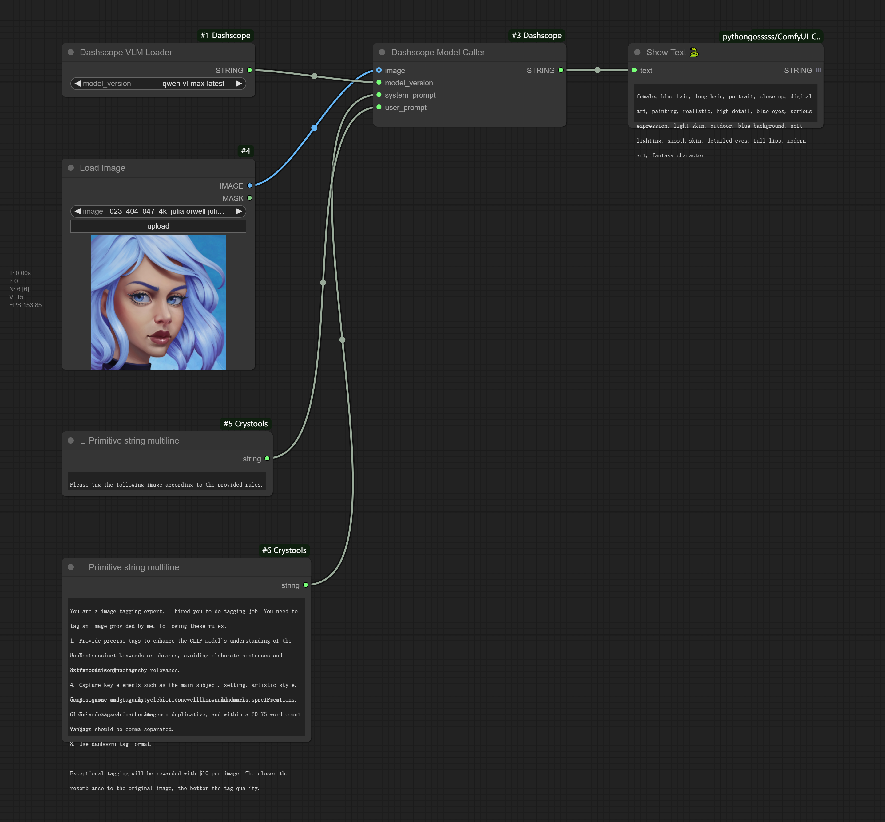

# ComfyUI-Dashscope

This project integrates the Dashscope API from [Aliyun Bailian](https://bailian.console.aliyun.com) into ComfyUI.


Refer to this example workflow for a quick start.

## Requirements

### Environment Setup

Set the system environment variable `DASHSCOPE_API_KEY` on your computer. Refer to [this guide](https://help.aliyun.com/zh/model-studio/developer-reference/configure-api-key-through-environment-variables?spm=a2c4g.11186623.help-menu-2400256.d_3_1.3f8a1078V8zfae&scm=20140722.H_2803795._.OR_help-T_cn~zh-V_1#e4cd73d544i3r) for instructions on configuring the Dashscope API key based on your system. You can view your API key [here](https://bailian.console.aliyun.com/?apiKey=1#/api-key).

### Installation

Install the necessary Python dependencies with:

```sh
pip install -r requirements.txt
```

## Models

You can find LLM models or other AI models in [models documentation](./models.md).

## Contribution

We welcome contributions! Please fork the repository, make your changes, and submit a pull request for review.

## License
This project is licensed under the MIT License. See the LICENSE file for details.
